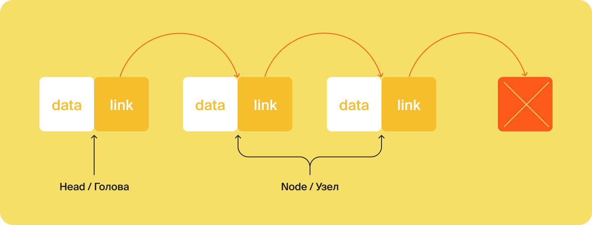
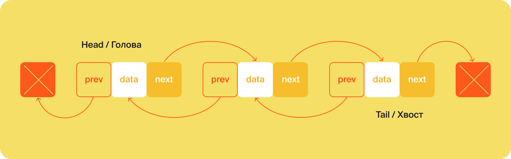
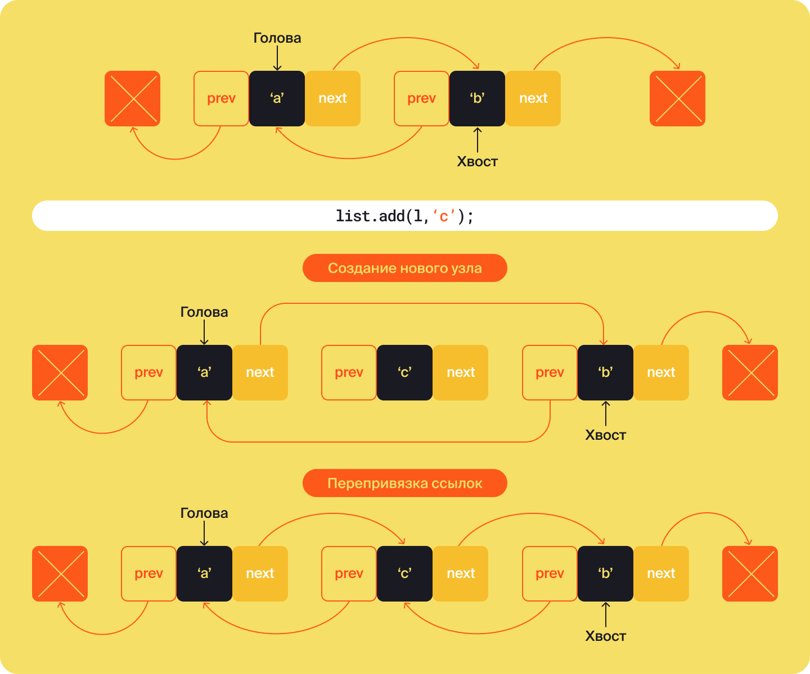

LinkedList

Класс LinkedList<T> — второй по популярности наследник интерфейса List. Он отвечает за реализацию двунаправленного связного списка

односвязный список (англ. singly linked list). Каждый элемент такого списка содержит не только данные (англ. data), но и ссылку (англ. link) на следующий элемент. В результате между элементами образуется связь. У неё одно направление — от начала к концу списка. Последний элемент ни на что не ссылается.

Связка из данных и ссылки называется узлом (англ. node), а первый элемент списка — головой (англ. head). 

.. Превращаем односвязный список в двусвязный

Двунаправленный связный список отличается от односвязного тем, что каждый узел ссылается не только на следующий, но и на предыдущий. Помимо головы выделяют хвост (англ. tail) — последний узел списка. У головы нет ссылки на предыдущий элемент (англ. previous, сокращённо prev), а у хвоста нет ссылки на следующий (англ. next).

Каждый узел двусвязного списка содержит три ссылки — на предыдущий элемент, на следующий и на данные. 

Методы LinkedList<T> и их сложность

По сравнению с ArrayList<T>, список LinkedList<T> дополнительно наследует от абстрактного класса AbstractSequentialList<T>

Этот класс отвечает за реализацию списка, где элементы хранятся в определённой последовательности. LinkedList<T> наследует основной способ использования AbstractSequentialList<T> — последовательный обход элементов друг за другом. Поскольку LinkedList<T> двунаправленный список — его операции могут применяться с двух сторон — с начала или с конца. 

    Методы addFirst(T) и addLast(T)

💡 Многие методы интерфейса List<T> транслируются в методы LinkedList<T>. Например, метод по добавлению элемента в конец add(T) вызывает метод addLast(T).

    Методы removeFirst() и removeLast()

За операцию удаления из начала списка отвечает метод removeFirst(), из конца —removeLast(). Их результатом также становится перемещение ссылок. Сложность этих операций — O(1)
O(1).

    Методы getFirst() и getLast()

Получить первый элемент списка LinkedList<T> можно с помощью метода getFirst(), последний — с помощью getLast(). Они также работают за константу O(1)
O(1).

    Методы add(int, T), remove(int) и get(int)

LinkedList<T> также поддерживает добавление, удаление и получение элемента по индексу. За это отвечают методы add(int, T), remove(int) и get(int). Все эти операции начинаются с поиска элемента с указанным индексом. При добавлении и удалении также происходит перепривязка ссылок двух соседних элементов. Например, на картинке-схеме показано, что происходит при вставке в середину двусвязного списка из элементов a и b нового элемента c. 

    Подсчёт элементов size()

У LinkedList<T> есть встроенная приватная переменная size, которая увеличивается при вставке нового элемента и уменьшается при удалении. Поэтому подсчёт элементов с помощью метода size() из интерфейса Collection<T> — константная операция для двусвязного списка. Она всегда выполняется за O(1)
O(1).